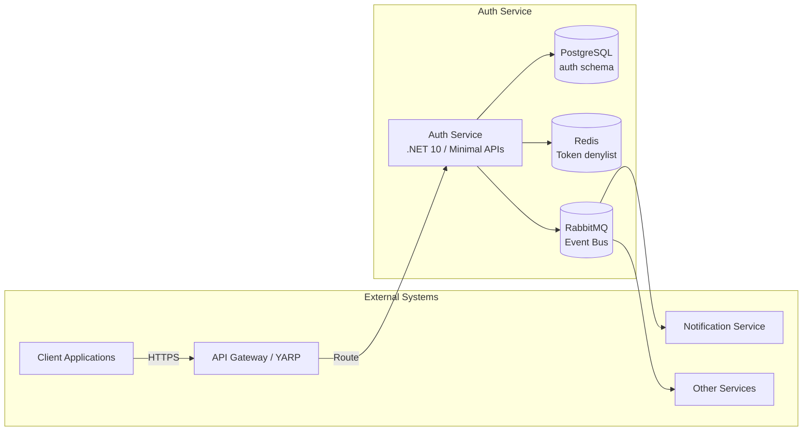
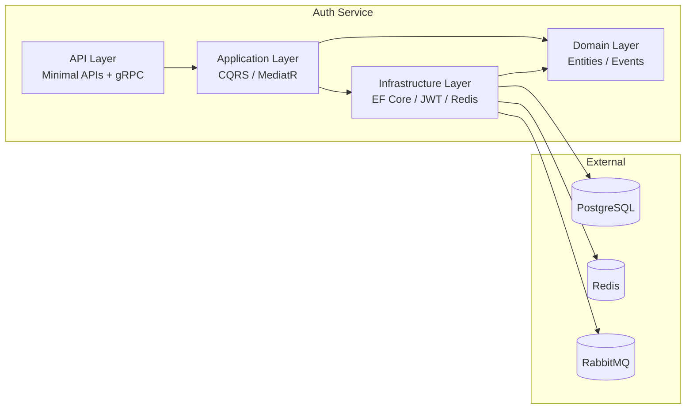
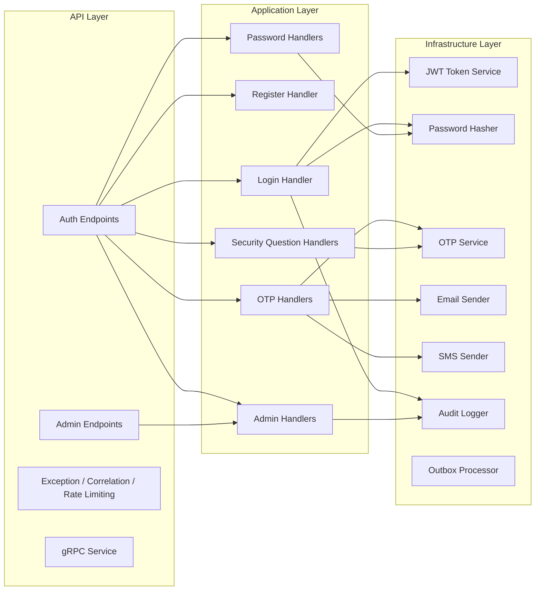
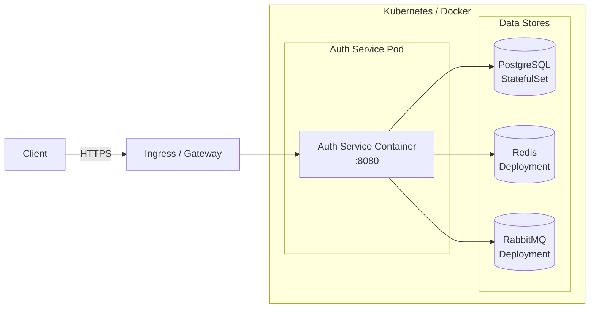

# C4 Model Diagrams

## Context Diagram

```mermaid
graph LR
    subgraph "External Systems"
        Client[Client Applications]
        Gateway[API Gateway / YARP]
        Notification[Notification Service]
        Other[Other Services]
    end

    subgraph "Auth Service"
        AuthService[Auth Service\n.NET 10 / Minimal APIs]
        AuthDB[(PostgreSQL\nauth schema)]
        Redis[(Redis\nToken denylist)]
        RabbitMQ[(RabbitMQ\nEvent Bus)]
    end

    Client -->|HTTPS| Gateway
    Gateway -->|Route| AuthService
    AuthService --> AuthDB
    AuthService --> Redis
    AuthService --> RabbitMQ
    RabbitMQ --> Notification
    RabbitMQ --> Other
```

## Container Diagram

```mermaid
graph LR
    subgraph "Auth Service"
        API[API Layer\nMinimal APIs + gRPC]
        App[Application Layer\nCQRS / MediatR]
        Domain[Domain Layer\nEntities / Events]
        Infra[Infrastructure Layer\nEF Core / JWT / Redis]
    end

    API --> App
    App --> Domain
    App --> Infra
    Infra --> Domain

    subgraph "External"
        Postgres[(PostgreSQL)]
        Redis[(Redis)]
        RabbitMQ[(RabbitMQ)]
    end

    Infra --> Postgres
    Infra --> Redis
    Infra --> RabbitMQ
```

## Component Diagram

```mermaid
graph LR
    subgraph "API Layer"
        AuthEndpoints[Auth Endpoints]
        AdminEndpoints[Admin Endpoints]
        Middleware[Exception / Correlation / Rate Limiting]
        Grpc[gRPC Service]
    end

    subgraph "Application Layer"
        LoginHandler[Login Handler]
        RegisterHandler[Register Handler]
        OtpHandlers[OTP Handlers]
        PasswordHandlers[Password Handlers]
        SecurityHandlers[Security Question Handlers]
        AdminHandlers[Admin Handlers]
    end

    subgraph "Infrastructure Layer"
        JwtTokenService[JWT Token Service]
        PasswordHasher[Password Hasher]
        OtpService[OTP Service]
        EmailSender[Email Sender]
        SmsSender[SMS Sender]
        AuditLogger[Audit Logger]
        OutboxProcessor[Outbox Processor]
    end

    AuthEndpoints --> LoginHandler
    AuthEndpoints --> RegisterHandler
    AuthEndpoints --> OtpHandlers
    AuthEndpoints --> PasswordHandlers
    AuthEndpoints --> SecurityHandlers
    AuthEndpoints --> AdminHandlers
    AdminEndpoints --> AdminHandlers

    LoginHandler --> JwtTokenService
    LoginHandler --> PasswordHasher
    LoginHandler --> AuditLogger
    OtpHandlers --> OtpService
    OtpHandlers --> EmailSender
    OtpHandlers --> SmsSender
    PasswordHandlers --> PasswordHasher
    SecurityHandlers --> OtpService
    AdminHandlers --> AuditLogger
```

## Deployment Diagram

```mermaid
graph LR
    subgraph "Kubernetes / Docker"
        subgraph "Auth Service Pod"
            Container[Auth Service Container\n:8080]
        end
        subgraph "Data Stores"
            Postgres[(PostgreSQL\nStatefulSet)]
            Redis[(Redis\nDeployment)]
            RabbitMQ[(RabbitMQ\nDeployment)]
        end
    end

    Client -->|HTTPS| Ingress[Ingress / Gateway]
    Ingress --> Container
    Container --> Postgres
    Container --> Redis
    Container --> RabbitMQ
```
