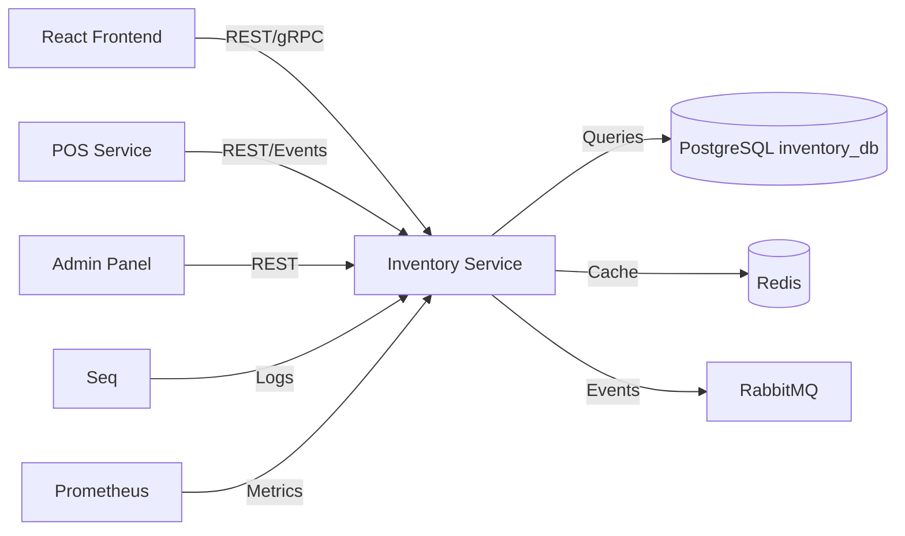
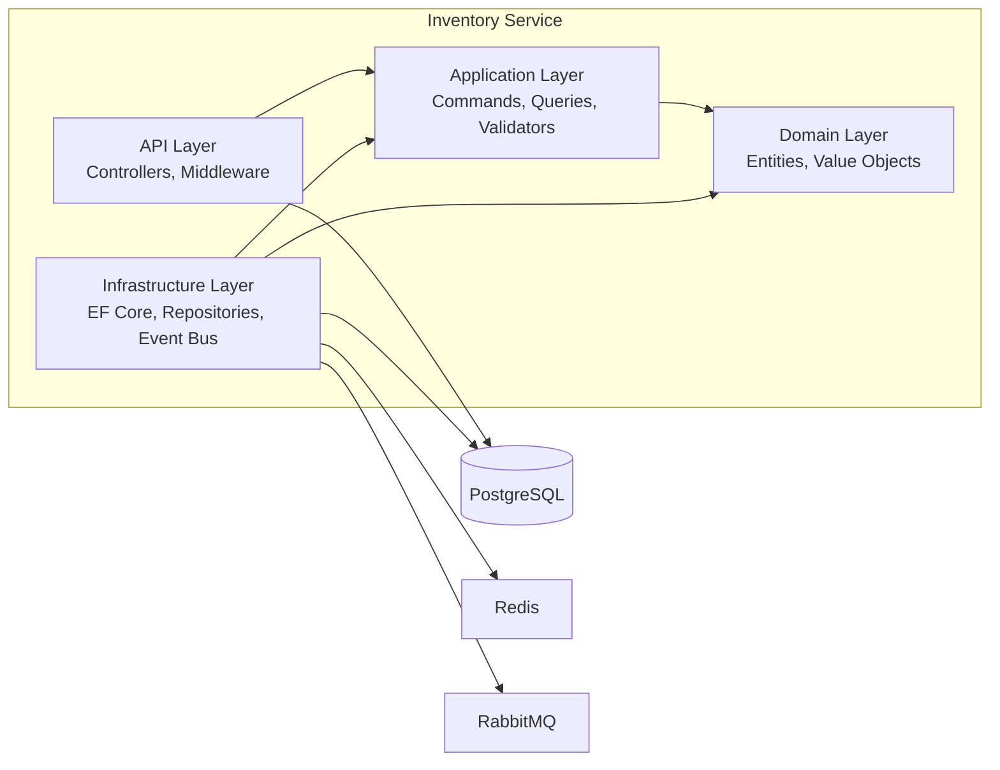
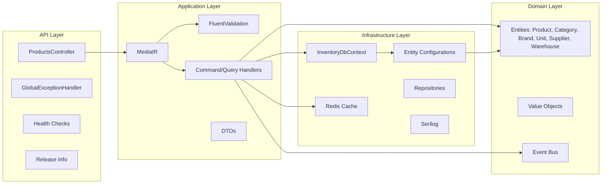
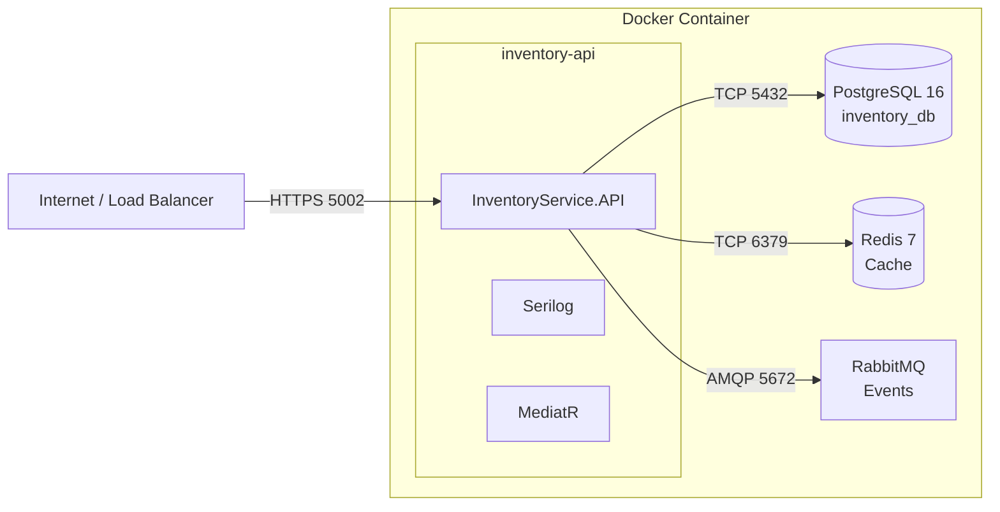

# C4 Architecture Documentation — Inventory Service

## 1. System Context

**Description:**
- React frontend consumes Inventory APIs for product management
- POS Service queries products and receives stock update events
- PostgreSQL is the primary datastore
- Redis caches frequently accessed products
- RabbitMQ enables async communication with POS
- Seq collects structured logs
- Prometheus scrapes metrics

---

## 2. Container Diagram

---

## 3. Component Diagram

---

## 4. Deployment Diagram

---

## 5. Key Design Decisions

1. **Clean Architecture:** Domain has no infrastructure dependencies
2. **CQRS:** Commands and Queries are separate, routed via MediatR
3. **Vertical Slice:** Each feature is self-contained in Application layer
4. **Provider Abstraction:** Database provider is configuration-driven
5. **Soft Delete:** All entities support soft delete via query filter
6. **Audit Trail:** Automatic population of audit fields
7. **Multi-tenancy:** tenant_id column on all tables
