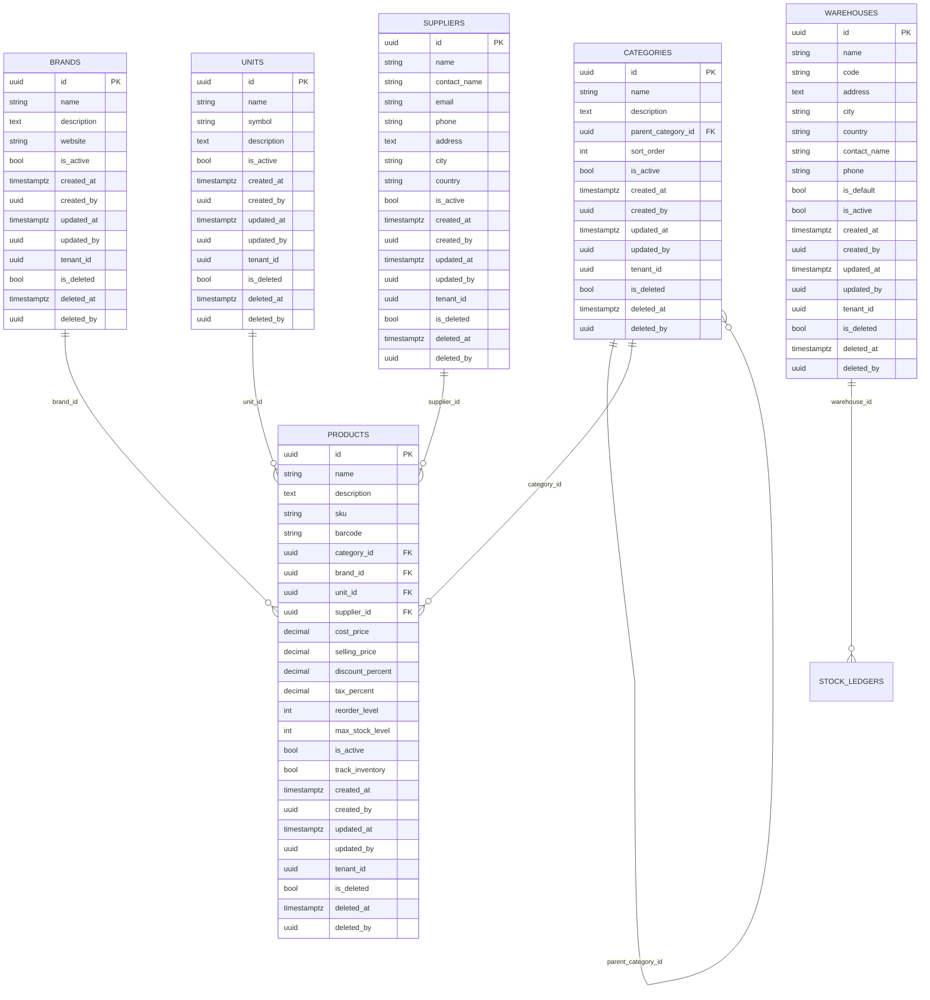

# Inventory Service Database Documentation

## 1. Schema Overview

**Database:** `inventory_db`  
**Schema:** `inventory`  
**Primary Database:** PostgreSQL 16  
**Migration History:** `20260810194119_InitialCreate`, `20260810194318_SeedInitialData`

---

## 2. Tables

### 2.1 `inventory.units`

**Purpose:** Measurement units for products (pcs, kg, liter, box, meter)

| Column | Type | Nullable | Default | Constraints |
|--------|------|----------|---------|-------------|
| id | uuid | NO | gen_random_uuid() | PRIMARY KEY |
| name | varchar(100) | NO | - | NOT NULL |
| symbol | varchar(20) | NO | - | UNIQUE, NOT NULL |
| description | varchar(500) | YES | - | - |
| is_active | boolean | NO | true | NOT NULL |
| created_at | timestamptz | NO | NOW() | NOT NULL |
| created_by | uuid | YES | - | - |
| updated_at | timestamptz | YES | - | - |
| updated_by | uuid | YES | - | - |
| tenant_id | uuid | YES | - | - |
| is_deleted | boolean | NO | false | NOT NULL |
| deleted_at | timestamptz | YES | - | - |
| deleted_by | uuid | YES | - | - |

**Indexes:**
- `idx_units_symbol` (UNIQUE) on `symbol`

**Seed Data:** 5 units (pcs, kg, liter, box, meter)

---

### 2.2 `inventory.categories`

**Purpose:** Product categories with hierarchical parent-child relationships

| Column | Type | Nullable | Default | Constraints |
|--------|------|----------|---------|-------------|
| id | uuid | NO | gen_random_uuid() | PRIMARY KEY |
| name | varchar(200) | NO | - | NOT NULL |
| description | varchar(500) | YES | - | - |
| parent_category_id | uuid | YES | - | FK → categories(id) |
| sort_order | integer | NO | 0 | NOT NULL |
| is_active | boolean | NO | true | NOT NULL |
| created_at | timestamptz | NO | NOW() | NOT NULL |
| created_by | uuid | YES | - | - |
| updated_at | timestamptz | YES | - | - |
| updated_by | uuid | YES | - | - |
| tenant_id | uuid | YES | - | - |
| is_deleted | boolean | NO | false | NOT NULL |
| deleted_at | timestamptz | YES | - | - |
| deleted_by | uuid | YES | - | - |

**Indexes:**
- `idx_categories_name` on `name`
- `idx_categories_parent_id` on `parent_category_id`

**Seed Data:** 5 categories (All, Grocery, Electronics, Clothing, Beverages)

---

### 2.3 `inventory.brands`

**Purpose:** Product brands

| Column | Type | Nullable | Default | Constraints |
|--------|------|----------|---------|-------------|
| id | uuid | NO | gen_random_uuid() | PRIMARY KEY |
| name | varchar(200) | NO | - | UNIQUE, NOT NULL |
| description | varchar(500) | YES | - | - |
| website | varchar(500) | YES | - | - |
| is_active | boolean | NO | true | NOT NULL |
| created_at | timestamptz | NO | NOW() | NOT NULL |
| created_by | uuid | YES | - | - |
| updated_at | timestamptz | YES | - | - |
| updated_by | uuid | YES | - | - |
| tenant_id | uuid | YES | - | - |
| is_deleted | boolean | NO | false | NOT NULL |
| deleted_at | timestamptz | YES | - | - |
| deleted_by | uuid | YES | - | - |

**Indexes:**
- `idx_brands_name` (UNIQUE) on `name`

**Seed Data:** 3 brands (Generic, TechPro, StyleWear)

---

### 2.4 `inventory.suppliers`

**Purpose:** Supplier/vendor information

| Column | Type | Nullable | Default | Constraints |
|--------|------|----------|---------|-------------|
| id | uuid | NO | gen_random_uuid() | PRIMARY KEY |
| name | varchar(200) | NO | - | NOT NULL |
| contact_name | varchar(200) | YES | - | - |
| email | varchar(200) | YES | - | - |
| phone | varchar(50) | YES | - | - |
| address | varchar(500) | YES | - | - |
| city | varchar(100) | YES | - | - |
| country | varchar(100) | YES | - | - |
| is_active | boolean | NO | true | NOT NULL |
| created_at | timestamptz | NO | NOW() | NOT NULL |
| created_by | uuid | YES | - | - |
| updated_at | timestamptz | YES | - | - |
| updated_by | uuid | YES | - | - |
| tenant_id | uuid | YES | - | - |
| is_deleted | boolean | NO | false | NOT NULL |
| deleted_at | timestamptz | YES | - | - |
| deleted_by | uuid | YES | - | - |

**Indexes:**
- `idx_suppliers_name` on `name`

---

### 2.5 `inventory.warehouses`

**Purpose:** Warehouse/location management

| Column | Type | Nullable | Default | Constraints |
|--------|------|----------|---------|-------------|
| id | uuid | NO | gen_random_uuid() | PRIMARY KEY |
| name | varchar(200) | NO | - | NOT NULL |
| code | varchar(50) | YES | - | UNIQUE |
| address | varchar(500) | YES | - | - |
| city | varchar(100) | YES | - | - |
| country | varchar(100) | YES | - | - |
| contact_name | varchar(200) | YES | - | - |
| phone | varchar(50) | YES | - | - |
| is_default | boolean | NO | false | NOT NULL |
| is_active | boolean | NO | true | NOT NULL |
| created_at | timestamptz | NO | NOW() | NOT NULL |
| created_by | uuid | YES | - | - |
| updated_at | timestamptz | YES | - | - |
| updated_by | uuid | YES | - | - |
| tenant_id | uuid | YES | - | - |
| is_deleted | boolean | NO | false | NOT NULL |
| deleted_at | timestamptz | YES | - | - |
| deleted_by | uuid | YES | - | - |

**Indexes:**
- `idx_warehouses_code` (UNIQUE) on `code`
- `idx_warehouses_default` on `is_default`

**Seed Data:** 2 warehouses (Main Warehouse, Branch Warehouse)

---

### 2.6 `inventory.products`

**Purpose:** Master product catalog

| Column | Type | Nullable | Default | Constraints |
|--------|------|----------|---------|-------------|
| id | uuid | NO | gen_random_uuid() | PRIMARY KEY |
| name | varchar(300) | NO | - | NOT NULL |
| description | varchar(1000) | YES | - | - |
| sku | varchar(100) | NO | - | UNIQUE, NOT NULL |
| barcode | varchar(100) | YES | - | UNIQUE |
| category_id | uuid | NO | - | FK → categories(id) |
| brand_id | uuid | NO | - | FK → brands(id) |
| unit_id | uuid | NO | - | FK → units(id) |
| supplier_id | uuid | YES | - | FK → suppliers(id) |
| cost_price | numeric(18,2) | NO | - | NOT NULL |
| selling_price | numeric(18,2) | NO | - | NOT NULL |
| discount_percent | numeric(5,2) | YES | - | - |
| tax_percent | numeric(5,2) | YES | - | - |
| reorder_level | integer | NO | 0 | NOT NULL |
| max_stock_level | integer | NO | 0 | NOT NULL |
| is_active | boolean | NO | true | NOT NULL |
| track_inventory | boolean | NO | true | NOT NULL |
| created_at | timestamptz | NO | NOW() | NOT NULL |
| created_by | uuid | YES | - | - |
| updated_at | timestamptz | YES | - | - |
| updated_by | uuid | YES | - | - |
| tenant_id | uuid | YES | - | - |
| is_deleted | boolean | NO | false | NOT NULL |
| deleted_at | timestamptz | YES | - | - |
| deleted_by | uuid | YES | - | - |

**Indexes:**
- `idx_products_sku` (UNIQUE) on `sku`
- `idx_products_barcode` (UNIQUE) on `barcode`
- `idx_products_category_id` on `category_id`
- `idx_products_brand_id` on `brand_id`
- `idx_products_unit_id` on `unit_id`
- `idx_products_supplier_id` on `supplier_id`
- `idx_products_is_active` on `is_active`

**Foreign Keys:**
- `FK_products_categories_category_id` → categories(id) RESTRICT
- `FK_products_brands_brand_id` → brands(id) RESTRICT
- `FK_products_units_unit_id` → units(id) RESTRICT
- `FK_products_suppliers_supplier_id` → suppliers(id) RESTRICT

**Seed Data:** None (products added via API)

---

## 3. Relationships

```
categories (1) ←—— (N) products
  parent_category_id → id (self-referencing)

brands (1) ←—— (N) products
suppliers (1) ←—— (N) products
units (1) ←—— (N) products
warehouses (1) ←—— (N) stock_ledgers (Phase E)
```

---

## 4. Indexes

All indexes are explicitly named with `idx_<table>_<column>` convention:
- Unique indexes enforce business rules (SKU, barcode, brand name, unit symbol)
- Non-unique indexes support frequent query patterns

---

## 5. Constraints

- **Primary Keys:** All `id` columns (UUID)
- **Unique Constraints:** SKU, barcode (products), name (brands), symbol (units), code (warehouses)
- **Foreign Keys:** RESTRICT on delete for referential integrity
- **Check Constraints:** None explicitly defined (enforced in domain)
- **Soft Delete:** `is_deleted` boolean with query filter

---

## 6. Audit Fields

Every table includes:
- `created_at` — Timestamp of creation (default NOW())
- `created_by` — UUID of creator
- `updated_at` — Timestamp of last update
- `updated_by` — UUID of last updater
- `is_deleted` — Soft delete flag (default false)
- `deleted_at` — Timestamp of deletion
- `deleted_by` — UUID of deleter
- `tenant_id` — Multi-tenant support (nullable for MVP)

---

## 7. Money Types

All monetary columns use `numeric(18,2)`:
- `products.cost_price`
- `products.selling_price`
- `products.discount_percent` (numeric(5,2))
- `products.tax_percent` (numeric(5,2))

Never use floating-point for financial calculations.

---

## 8. Migration Strategy

```bash
# Create migration
dotnet ef migrations add <Description> \
  --project services/inventory-service/src/InventoryService.Infrastructure \
  --startup-project services/inventory-service/src/InventoryService.API

# Apply migration
dotnet ef database update \
  --project services/inventory-service/src/InventoryService.Infrastructure \
  --startup-project services/inventory-service/src/InventoryService.API

# Rollback
dotnet ef database update <PreviousMigration> \
  --project services/inventory-service/src/InventoryService.Infrastructure \
  --startup-project services/inventory-service/src/InventoryService.API
```

---

## 9. Seed Strategy

Seed data is embedded in migrations using `migrationBuilder.InsertData()`. This ensures:
- Reproducible environments
- Idempotent deployments
- No external seed scripts required

---

## 10. ER Diagram (Mermaid)



---

## 11. Backup & Restore

```bash
# Backup
pg_dump -U postgres -d inventory_db -F c -f inventory_db_backup.dump

# Restore
pg_restore -U postgres -d inventory_db_restored -c inventory_db_backup.dump

# Schema only
pg_dump -U postgres -d inventory_db -s -f inventory_db_schema.sql

# Data only
pg_dump -U postgres -d inventory_db -a -f inventory_db_data.sql
```

---

## 12. Database Decisions

- **UUID Primary Keys:** Distributed-system friendly, no coordination needed
- **Soft Delete:** All entities support soft delete via query filter
- **Audit Fields:** Automatic population via BaseDbContext
- **Multi-tenancy:** tenant_id column on all tables (future RLS)
- **Money Types:** numeric(18,2) for financial precision
- **Snake Case:** Column names use snake_case via explicit configuration
- **Schema:** All tables in `inventory` schema for logical separation
