# C4 Component Diagram

```mermaid
graph TD
    subgraph "Api Layer"
        RestEndpoints["REST Endpoints"]
        GrpcEndpoints["gRPC Endpoints"]
        Middleware["Middleware Pipeline"]
    end

    subgraph "Application Layer"
        SendHandler["SendNotificationHandler"]
        GetHandler["GetNotificationsHandler"]
        CancelHandler["CancelNotificationHandler"]
        RetryHandler["RetryNotificationHandler"]
        TemplateHandlers["Template CRUD Handlers"]
        PreferenceHandlers["Preference Handlers"]
        Validators["FluentValidation Validators"]
        Ports["Port Interfaces"]
    end

    subgraph "Infrastructure Layer"
        DbContext["NotificationDbContext"]
        Outbox["OutboxEventPublisher + OutboxProcessor"]
        RabbitMQPublisher["RabbitMqPublisher"]
        RabbitMQConsumer["NotificationEventConsumer"]
        EmailSender["SmtpEmailSender"]
        SmsSender["TwilioSmsSender / GenericHttpSmsSender"]
        PushSender["FcmPushSender"]
        DispatchJob["NotificationDispatchJob"]
        RecoveryJob["StuckNotificationRecoveryJob"]
        TemplateRenderer["ScribanTemplateRenderer"]
        Localization["ResourceLocalizationService"]
        RetryPolicy["ChannelRetryPolicyFactory"]
    end

    RestEndpoints --> SendHandler
    RestEndpoints --> GetHandler
    RestEndpoints --> CancelHandler
    RestEndpoints --> RetryHandler
    RestEndpoints --> TemplateHandlers
    RestEndpoints --> PreferenceHandlers
    GrpcEndpoints --> SendHandler
    GrpcEndpoints --> GetHandler

    SendHandler --> Ports
    GetHandler --> Ports
    CancelHandler --> Ports
    RetryHandler --> Ports
    TemplateHandlers --> Ports
    PreferenceHandlers --> Ports

    Ports --> DbContext
    Ports --> Outbox
    Ports --> TemplateRenderer
    Ports --> Localization

    Outbox --> RabbitMQPublisher
    RabbitMQConsumer --> SendHandler
    DispatchJob --> EmailSender
    DispatchJob --> SmsSender
    DispatchJob --> PushSender
    DispatchJob --> RetryPolicy
```

## Key Components

| Component | Responsibility |
|---|---|
| REST/gRPC Endpoints | Accept requests, validate auth, apply rate limiting |
| MediatR Handlers | Execute use cases, enforce business rules |
| FluentValidation | Validate input before handler execution |
| NotificationDbContext | Persist aggregates, soft-delete filters, optimistic concurrency |
| OutboxProcessor | Relay staged events to RabbitMQ |
| NotificationDispatchJob | Single dispatch point for all outbound sends |
| Channel Senders | Provider-specific delivery (SMTP, Twilio, FCM) |
