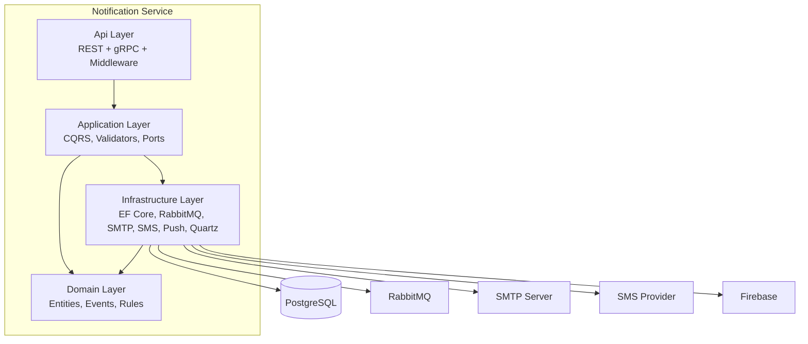

# C4 Container Diagram

## Container Descriptions

| Container | Technology | Responsibility |
|---|---|---|
| Api | ASP.NET Core Web API | REST + gRPC endpoints, middleware, auth, rate limiting, OpenTelemetry |
| Application | .NET Class Library | MediatR handlers, FluentValidation, Result Pattern, port interfaces |
| Domain | .NET Class Library | Aggregate roots, domain events, business rules, zero framework deps |
| Infrastructure | .NET Class Library | EF Core, RabbitMQ, MailKit SMTP, Twilio/GenericHttp SMS, FCM push, Quartz, Scriban |
