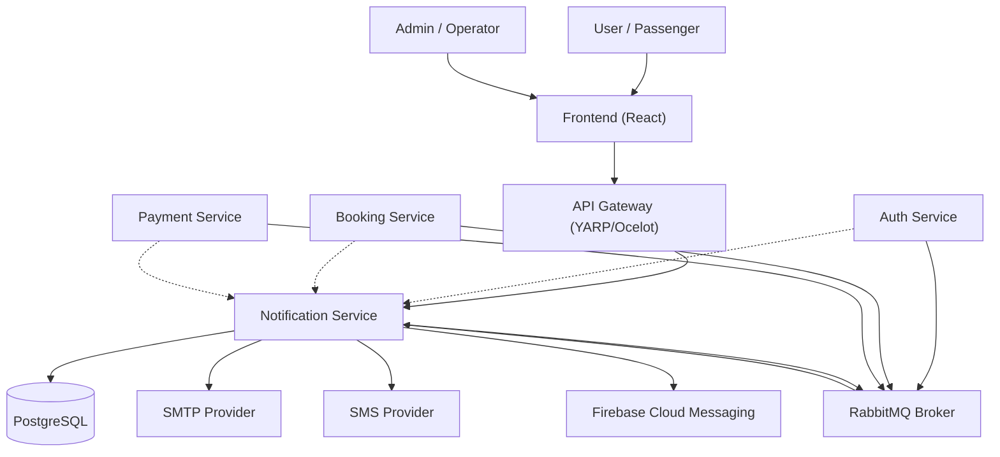

# C4 Context Diagram

## Description

- **Users** interact with the platform through the Frontend, which routes through the API Gateway.
- **Auth/Booking/Payment Services** publish domain events to RabbitMQ.
- **Notification Service** consumes upstream events and sends notifications via email, SMS, and push.
- **Notification Service** exposes REST and gRPC endpoints for direct invocation.
- Data is persisted in **PostgreSQL**.
