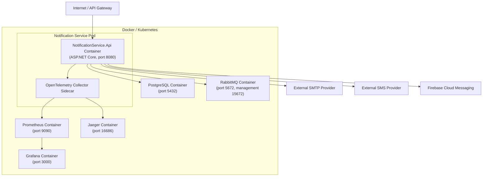

# C4 Deployment Diagram

## Deployment Notes

- The service runs as a Docker container on port 8080 (configurable).
- Health checks probe `/health` for liveness and `/metrics` for Prometheus scraping.
- OpenTelemetry exports traces and metrics to a collector sidecar or directly to Jaeger/Prometheus.
- External provider calls (SMTP, SMS, FCM) are made over the public internet.
- RabbitMQ is used for both inbound (upstream events) and outbound (notification events) messaging.
